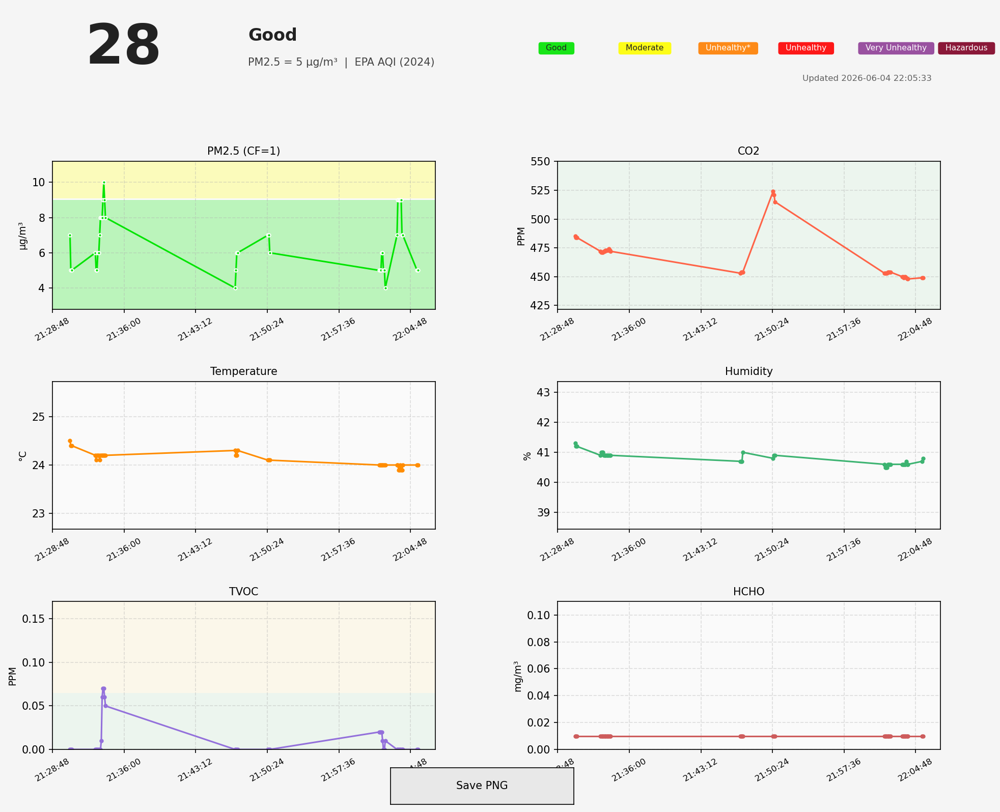

# PTQS1005 Air Quality Monitor

Python tooling for the [PTQS1005](https://www.plantower.com/) multi-sensor module (PM2.5, CO₂, TVOC, HCHO, temperature, humidity) over UART via a CP210x USB-to-TTL adapter.

## Hardware

| Item | Detail |
|---|---|
| Sensor | PTQS1005 (Beijing Panteng Technology) |
| Interface | UART — 9600 baud, 8N1 |
| Adapter | Silicon Labs CP210x USB-to-TTL |
| Port | `/dev/ttyUSB0` |

## Setup

```bash
pip install -r requirements.txt

# allow serial port access without sudo
sudo usermod -aG dialout $USER   # log out and back in after this
```

## Scripts

### `ptqs1005_read.py` — poll and log

Sends a read command to the sensor every N seconds, prints a summary line, and appends rows to a CSV file.

```bash
# general data (PM2.5, TVOC, HCHO, CO2, temp, humidity) every 5 s
python3 ptqs1005_read.py

# full particle data (PM1/2.5/10 + size counts) every 10 s, custom CSV
python3 ptqs1005_read.py full 10 my_log.csv
```

**CSV columns (general mode):**
`timestamp, pm25_cf1_ugm3, tvoc_ppm, hcho_mgm3, co2_ppm, temperature_c, humidity_pct`

### `ptqs1005_plot.py` — one-shot plot

Reads a CSV file and saves a 6-panel PNG.

```bash
python3 ptqs1005_plot.py ptqs1005_log.csv
```

### `ptqs1005_live.py` — live dashboard

Logs to CSV in a background thread while a matplotlib window auto-refreshes every N seconds.

```bash
python3 ptqs1005_live.py            # 5 s interval, default CSV
python3 ptqs1005_live.py 3 my.csv  # 3 s interval, custom CSV
```

**Features:**
- EPA 2024 PM2.5 AQI banner with colour coding (Good → Hazardous)
- Colour-coded threshold bands on PM2.5, CO₂, and TVOC plots
- **Save PNG** button — exports a timestamped snapshot next to the CSV



## AQI reference

| AQI | Category | PM2.5 (µg/m³) |
|-----|----------|----------------|
| 0–50 | Good | 0–9 |
| 51–100 | Moderate | 9.1–35.4 |
| 101–150 | Unhealthy for Sensitive Groups | 35.5–55.4 |
| 151–200 | Unhealthy | 55.5–150.4 |
| 201–300 | Very Unhealthy | 150.5–250.4 |
| 301–500 | Hazardous | 250.5–500.4 |

*Breakpoints follow the EPA 2024 revised NAAQS for PM2.5.*

## Protocol

See `PTQS1005-TTL.md` for the full UART and I²C protocol datasheet.
